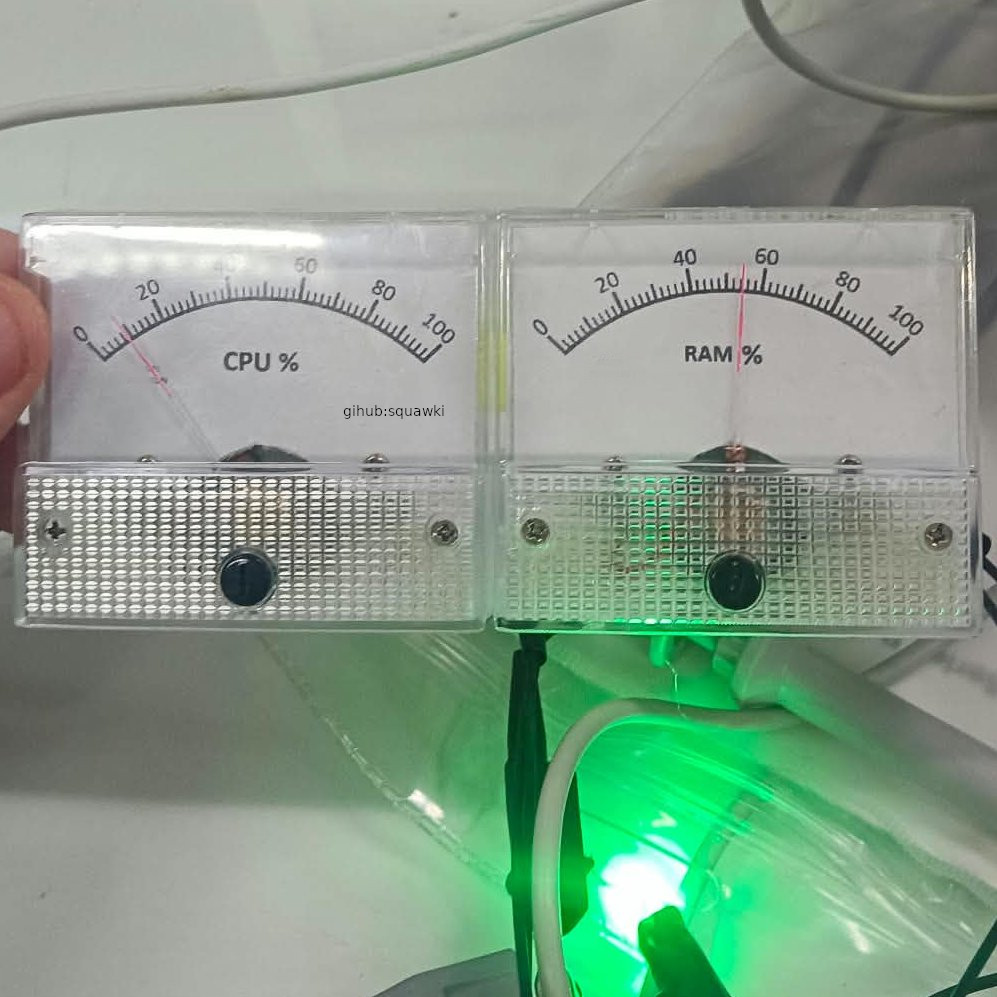
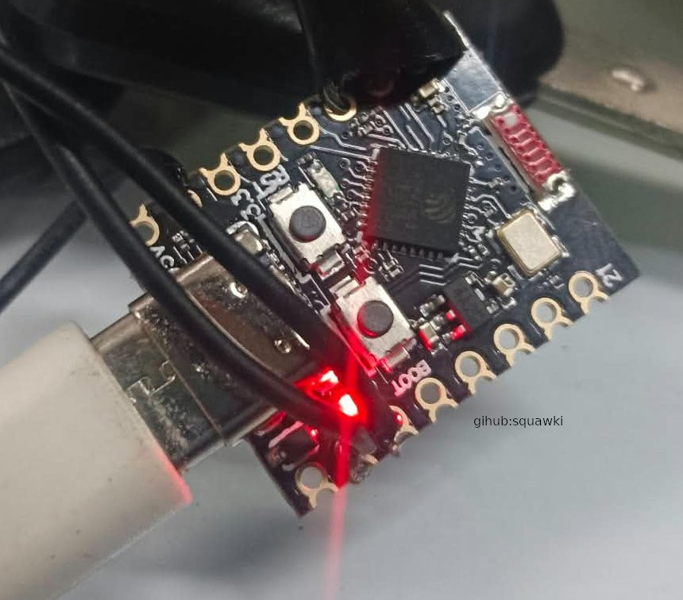

# CPU & RAM Gauges - Powered by ESP32-C3
A physical CPU and RAM monitor for a Linux computer or server, built around an ESP32-C3-Zero and two analogue moving-coil gauges.

The server sends CPU and physical memory usage over USB to the ESP32, which converts the values into smooth movements of the two gauges. An RGB LED provides a visual status indicator, with the ESP32 firmware also supporting manual colours, brightness control and an automatic status mode.

The project is intentionally simple. Rather than displaying another set of numbers on a screen, it provides a physical, always-visible indication of server activity. The gauges respond gradually to changes in system load, while a communication failure causes both gauges to enter a visible fault sweep and the RGB LED to turn red.

The Linux side currently monitors CPU and RAM, with the ESP32 firmware providing additional LED control commands that can be used by the server script in future.


## Features

- Real-time CPU utilisation gauge
- Real-time physical RAM utilisation gauge
- USB serial communication between the Linux server and ESP32
- Smooth gauge movement rather than abrupt changes
- Adjustable gauge response and smoothing
- Automatic communication failure detection
- Fault mode with an alternating gauge sweep when communication is lost
- RGB LED status indication
- Automatic LED status mode:
  - Blue while waiting for telemetry
  - Green during normal communication
  - Red when communication is lost
- Manual RGB colour control through the ESP32 serial interface
- Adjustable LED brightness
- Separate LED on/off and brightness controls
- ESP32 acknowledgement of received CPU and RAM values
- Runs as a systemd service on the Linux server
- No network connection required between the server and ESP32
- Uses standard Linux `/proc` system information for CPU and memory usage
- Custom printable gauge face and backplate template included
## Hardware Required

### Main components

| Component | Quantity | Notes |
|---|---:|---|
| ESP32-C3-Zero | 1 | Waveshare ESP32-C3-Zero used for this project |
| ZHFU 85C1 analogue gauge | 2 | 1 mA DC moving-coil panel meter |
| 2 kΩ resistor | 2 | One resistor in series with each gauge |
| Common-cathode RGB LED | 1 | Used for system status indication |
| 200Ω Current-limiting resistors | 3 | One resistor for each RGB LED channel |
| USB cable | 1 | Connects the ESP32 to the Linux/Proxmox server |
| Hook-up wire | As required | 28 AWG is suitable for the gauge wiring |

### Optional / construction materials

- Printed gauge faceplates
- Printed backplate or mounting template
- Panel or enclosure for mounting the gauges and ESP32
- Connectors or terminal blocks as required
- Suitable mounting hardware

### Gauge specification

The gauges used in this build are:

**ZHFU 85C1 (1 milli amp)**

- DC moving-coil analogue meter
- 64 × 56 × 52 mm
- 1 mA range

The original gauge was replaced with a custom faceplate to show CPU/RAM instead, the scale was not changed.

The 2 kΩ series resistors limit the current supplied by the ESP32 GPIO pins and allow the gauge movement to be driven safely using PWM.

## How It Works

The project is split into two parts: a Linux server component and an ESP32 firmware component.

┌─────────────────────────────┐
│       Linux Client          │
│                             │
│       gauges.sh             │
│                             │
│  Reads CPU and RAM usage    │
└──────────────┬──────────────┘
               │
               │ USB Serial
               │ 115200 baud
               │
┌──────────────▼──────────────┐
│       ESP32-C3-Zero         │
│                             │
│  Receives CPU/RAM values    │
│  Smooths gauge movement     │
│  Controls RGB status LED    │
│  Monitors communication     │
└──────┬────────┬─────────┬───┘
       │        │         │
    GPIO 7   GPIO 6    GPIO 0/1/2
       │        │         │
  ┌────▼──┐ ┌──▼────┐ ┌──▼─────────┐
  │  CPU  │ │  RAM  │ │ RGB LED    │
  │ Gauge │ │ Gauge │ │            │
  └───────┘ └───────┘ └────────────┘

### Linux Server

`gauges.sh` runs on the Linux or Proxmox server and periodically reads system statistics from the Linux `/proc` filesystem.

CPU utilisation is calculated from the CPU counters in `/proc/stat`.

Physical memory utilisation is calculated from `/proc/meminfo` using:

```text
Used memory = MemTotal - MemAvailable
```

Swap is not included in the RAM percentage.

The resulting values are sent to the ESP32 over the USB serial connection:

```text
CPU=42
RAM=68
```

The server sends updated values once per second.

### ESP32

The ESP32 receives the telemetry and converts the 0 to 100% values into PWM output for the two analogue gauges.

The gauges are connected to:

- **GPIO 7:** CPU gauge
- **GPIO 6:** RAM gauge

The gauges are updated independently and use software smoothing so that their movement resembles a physical instrument rather than immediately jumping between values.

The ESP32 also controls a common-cathode RGB LED:

- **GPIO 0:** Red
- **GPIO 1:** Green
- **GPIO 2:** Blue
- **Common cathode:** ESP32 GND

Each RGB LED channel uses its own current-limiting resistor.

The ESP32 sends acknowledgements back to the server:

```text
ACK CPU=42.0
ACK RAM=68.0
```

These acknowledgements allow the Linux script to determine whether communication with the ESP32 is working.

### Communication Failure

The ESP32 monitors the time since the last valid CPU or RAM message.

If no valid telemetry is received for 3 seconds, the ESP32 considers communication to have failed.

It then:

1. Enters fault mode.
2. Moves the CPU and RAM gauges in opposite directions through a continuous sweep.
3. Forces the RGB LED to solid red at full brightness.
4. Reports the communication failure over serial.

When telemetry is received again, the fault mode is cleared and the gauges return to normal operation.

This means the physical panel can indicate a server or USB communication problem even when the server is no longer able to update the gauges.

## Installation and Setup

### 1. Flash the ESP32

Open the ESP32 firmware in the Arduino IDE.

Select the appropriate ESP32-C3 board and connect the ESP32-C3-Zero over USB.

The firmware uses:

- **CPU frequency:** 40 MHz
- **Flash frequency:** 80 MHz
- **USB:** Serial communication
- **Baud rate:** 115200

Upload the firmware to the ESP32.

After uploading, open the Serial Monitor at **115200 baud** to verify that the controller starts correctly.

### 2. Connect the ESP32 to the Server

Connect the ESP32 to the Linux or Proxmox server using USB.

The ESP32 should appear as a serial device, normally:

```text
/dev/ttyACM0
```

Check the available serial devices with:

```bash
ls /dev/ttyACM*
```

If a different device name is assigned, update the `SERIAL_PORT` setting in `gauges.sh`.

### 3. Install the Linux Script

Copy `gauges.sh` to the desired location on the server:

```text
/scripts/gauges.sh
```

Make the script executable:

```bash
sudo chmod +x /scripts/gauges.sh
```

The script reads CPU and memory information from `/proc` and sends the values to the ESP32 once per second.

Run it manually first to confirm that the gauges respond correctly:

```bash
sudo /scripts/gauges.sh
```

The script displays the current CPU and RAM values along with the serial communication status.

Press `Ctrl+C` to stop the script.

### 4. Install the systemd Service

Copy the included service file to:

```text
/etc/systemd/system/gauges.service
```

Then reload systemd:

```bash
sudo systemctl daemon-reload
```

Enable the service so it starts automatically with the server:

```bash
sudo systemctl enable gauges.service
```

Start it:

```bash
sudo systemctl start gauges.service
```

Check the service status:

```bash
sudo systemctl status gauges.service
```

The gauges should now update automatically whenever the server is running.

### 5. Useful Service Commands

Restart the service:

```bash
sudo systemctl restart gauges.service
```

Stop the service:

```bash
sudo systemctl stop gauges.service
```

Disable automatic startup:

```bash
sudo systemctl disable gauges.service
```

Once installed, the ESP32 can remain connected to the server and operate without any additional software or network connection.
## LED Control

The ESP32 firmware supports several serial commands for controlling the RGB status LED.

These commands can be sent directly over the USB serial connection and can also be integrated into `gauges.sh` in the future.

### Automatic Status Mode

The automatic mode changes the LED colour based on the current communication state:

```text
LED=AUTO
```

The LED indicates:

| State | Colour |
|---|---|
| Waiting for telemetry | Blue |
| Normal communication | Green |
| Communication lost | Red |

Communication failure always takes priority over manual LED settings and forces the LED to solid red at full brightness.

### Manual Colours

The firmware includes several predefined colours:

```text
LED=RED
LED=GREEN
LED=BLUE
LED=YELLOW
LED=CYAN
LED=MAGENTA
LED=WHITE
```

An arbitrary RGB colour can also be selected:

```text
LED=RGB,255,128,0
```

RGB values range from `0` to `255`.

### Brightness

LED brightness can be adjusted independently of the selected colour:

```text
LED=DIM,50
```

The value represents a percentage from `0` to `100`.

For example:

```text
LED=DIM,25
```

sets the LED to 25% brightness.

### LED On and Off

The LED can be disabled without changing the currently selected colour or brightness:

```text
LED=OFF
```

It can then be restored with:

```text
LED=ON
```

### Future Linux Integration

The current `gauges.sh` script only sends CPU and RAM telemetry. It does not currently send LED control commands.

The LED command interface is already implemented in the ESP32 firmware, allowing additional status information or server events to be added to the Linux side in the future without changing the ESP32 protocol.

## Frequently Asked Questions

### Do all of the grounds need to be connected together?

Yes.

The ESP32, gauges and RGB LED need to share a common ground. The ESP32 GND is the reference for the gauge outputs and the RGB LED.

For example:

```text
ESP32 GND
   ├── CPU gauge
   ├── RAM gauge
   └── RGB LED common cathode
```

The USB connection to the server also provides the ESP32 ground reference.

### Can I use a different gauge?

Yes, provided the gauge is suitable for the way it is being driven.

The firmware uses PWM to control the current through the moving-coil gauges. If you use a different gauge, the series resistor and maximum PWM value may need to be changed.

Do not remove the series resistors simply because a different gauge does not reach full scale.

### How do I calibrate the gauge to 100%?

The gauge scale can be calibrated in the firmware using the maximum PWM percentage.

The relevant setting is:

```cpp
GAUGE_MAX_PERCENT = 66.0f;
```

This determines how much PWM is used when the reported CPU or RAM value reaches 100%.

If the gauge does not reach the desired 100% position, increase this value.

If it goes past the desired 100% position, decrease it.

This allows the physical gauge to be calibrated without changing the Linux script or the gauge face.

### Why does the gauge reach full scale before 100% PWM?

The gauge and series resistor determine how much current is required to reach full physical movement.

In this build, the gauge reaches its calibrated full-scale position at approximately 66% PWM rather than 100%.

This is intentional. The remaining PWM range is unused to keep the gauge within its intended operating range.

### Can I change the gauge response speed?

Yes.

The CPU and RAM gauges use separate smoothing periods in the ESP32 firmware.

This allows the gauges to respond quickly enough to show changes in server load while avoiding constant rapid movement.

If you want the gauges to react more quickly, reduce the smoothing time.

If you want slower and more stable movement, increase it.

### Why are the gauges not jumping immediately to the current value?

The gauges use software smoothing.

A physical moving-coil gauge naturally has some mechanical damping, so smoothing the incoming values makes the display look more like an analogue instrument and prevents rapid changes in CPU or RAM usage from causing excessive movement.

### What happens if the server stops sending data?

After 3 seconds without valid telemetry, the ESP32 enters communication fault mode.

The gauges perform an alternating sweep and the RGB LED turns solid red at full brightness.

When valid telemetry is received again, normal operation resumes.

### Does the ESP32 need Wi-Fi?

No.

The project uses USB serial communication between the Linux server and the ESP32.

No Wi-Fi, Bluetooth or network connection is required.


### Is swap included in the RAM gauge?

No.

The RAM percentage is based on physical memory:

```text
Used memory = MemTotal - MemAvailable
```

Swap usage is not included.

### What does the RGB LED indicate?

In automatic mode:

- **Blue:** Waiting for telemetry
- **Green:** Normal communication
- **Red:** Communication lost

A communication fault overrides the normal LED settings and forces the LED to solid red at full brightness.

### Can I control the RGB LED manually?

Yes.

The ESP32 supports predefined colours, arbitrary RGB values, brightness control, on/off control and automatic status mode.

See the [LED Control](#led-control) section for the available commands.

### Why does my ESP32 show a different serial device name?

Linux may assign a different device name depending on the system and USB configuration.

The default configuration uses:

```text
/dev/ttyACM0
```

Check which device was assigned with:

```bash
ls /dev/ttyACM*
```

If necessary, update the serial port in `gauges.sh`.

### Can I run the gauge wiring over a long cable?

Yes.

The gauge wiring in this build uses approximately 5 metres of cable.

28 AWG hook-up wire is suitable for this application. Longer cable runs for tens of meters may also work, although excessive cable length can introduce additional resistance and electrical noise.

### Do I need a capacitor across the gauges?

No.

The current build does not require additional capacitors on the gauge outputs.

The PWM signal is handled by the ESP32 and the moving-coil mechanism naturally averages the rapidly changing signal.

### Why is the PWM frequency 500 Hz?

The gauges are mechanical moving-coil instruments, so they respond to the average effect of the PWM signal rather than following each individual pulse.

A 500 Hz PWM frequency provides a suitable balance for this application while keeping the implementation simple.

### Can I remove the 2 kΩ gauge resistors?

No.

The 2 kΩ resistors are part of the gauge drive circuit and limit the current supplied by the ESP32 GPIO pins.

They should remain in series with the gauges.

### Can I change the GPIO pins?

Yes, but the firmware must be updated to match.

The current build uses:

```text
GPIO 7  -> CPU gauge
GPIO 6  -> RAM gauge

GPIO 1  -> Red LED
GPIO 2  -> Green LED
GPIO 0  -> Blue LED
```

Avoid using ESP32-C3 pins that are already required for USB, boot functions or onboard hardware unless you understand the consequences.

### Does the Linux script need to run continuously?

Yes.

`gauges.sh` is designed to run continuously and send updated CPU and RAM values to the ESP32 once per second.

The included systemd service keeps it running automatically and restarts it if it exits.

### Can I use the ESP32 without the Linux script?

Yes, for testing.

The ESP32 can be connected to a computer and controlled through its serial interface. This is also useful for testing the gauges and RGB LED independently of the Linux monitoring script.

### Can I use the project without the RGB LED?

Yes.

The gauges do not depend on the RGB LED for operation. The LED is a visual status indicator and can be omitted if desired.

### Can I use different resistors for the RGB LED?

Yes.

Each RGB LED channel should have its own appropriate current-limiting resistor.

The required value depends on the LED and desired current. Do not connect the RGB channels directly to the ESP32 GPIO pins without current limiting.
200-500ohm is a good starting part.

### Can I change the faceplate or gauge artwork?

Yes.

The gauge face is purely cosmetic and does not affect the electronics. Most gauges can be opened up pretty easily.

The included template can be modified or replaced with your own design. The important part is that the printed 0 to 100% scale matches the calibrated physical movement of the gauge, this will change for each printer/software/paper-size

### What happens if I change the gauge or resistor?

You will probably need to recalibrate `GAUGE_MAX_PERCENT`.

The Linux side still reports 0 to 100% and does not need to know anything about the physical gauge. The ESP32 firmware handles the conversion from the reported percentage to the appropriate PWM output.
